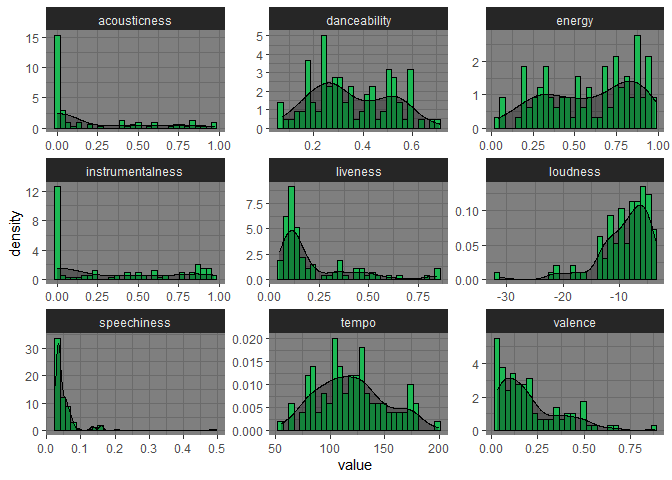
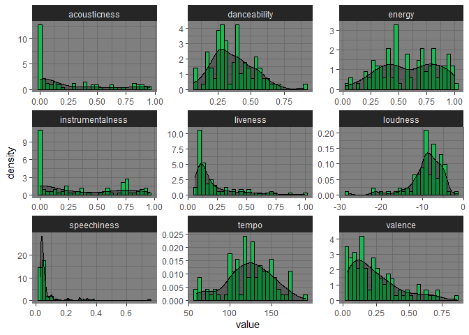
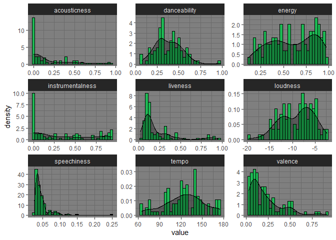
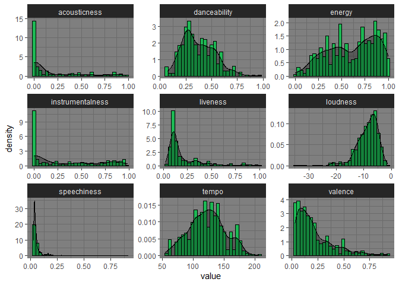

Does Spotify Provide Me With Quality Recommendations?
================

By: Richard Austyn McLaughlin
-----------------------------

Executive Summary
-----------------

For my project I wanted to see just how well Spotify does at recommending me new music. Spotify uses machine learning to create new playlists every year to recommend me new music based off of my music tastes. I gathered data from my playlists, explored various audio features of songs, and used Support Vector Machines to predict if the songs fit my taste or not. In my analysis, I found that Spotify does a reasonable job at matching audio features that I might be interested in, but not well enough as I'd like.

Summary of Learning
-------------------

I have learned a lot from this project. Namely, pulling data from an API, joining different tables to get a more complete dataset, and how to explore and apply models to that data. I had many challenges in gathering the data I wanted to use. First, there was issues with gathering every song on each playlist I wanted to use because Spotify's API limits you to only gather information about 100 songs at once, and then I needed to find a way to get all the songs for all of the playlists I wanted to use. I wanted to be able to use my music taste, but I had to first define songs that defined my taste. I found that Spotify's data was remarkably tidy and had many audio features that describe each song. I have listened to Spotify for over 6 years now and have a personal connection to the app as it has been my home for all things music.

Dataset
-------

My dataset comes directly from my Spotify playlists, pulled using RCharlie's spotifyR library. Included are 4 playlists of my top 100 tracks from the last four years and three additional playlists with various numbers of recommended songs that Spotify has created for me. Not needing all of the features that Spotify offers through its API, I selected only audio features and the artists, albums, and track names for each track to use for training my model. I also ended up adding a label to describe if the song came from my library or from a Spotify recommendation. I then shuffled all of the data so I could have more mixed data for the models. Below are desciptions of the audio features that aren't self-explanatory.

##### Instrumentalness: This value represents the amount of vocals in the song. The closer it is to 1.0, the more instrumental the song is.

##### Acousticness: This value describes how acoustic a song is. A score of 1.0 means the song is most likely to be an acoustic one.

##### Liveness: This value describes the probability that the song was recorded with a live audience. According to the official documentation "a value above 0.8 provides strong likelihood that the track is live".

##### Speechiness: "Speechiness detects the presence of spoken words in a track". If the speechiness of a song is above 0.66, it is probably made of spoken words, a score between 0.33 and 0.66 is a song that may contain both music and words, and a score below 0.33 means the song does not have any speech.

##### Energy: "(energy) represents a perceptual measure of intensity and activity. Typically, energetic tracks feel fast, loud, and noisy".

##### Danceability: "Danceability describes how suitable a track is for dancing based on a combination of musical elements including tempo, rhythm stability, beat strength, and overall regularity. A value of 0.0 is least danceable and 1.0 is most danceable".

##### Valence: "A measure from 0.0 to 1.0 describing the musical positiveness conveyed by a track. Tracks with high valence sound more positive (e.g. happy, cheerful, euphoric), while tracks with low valence sound more negative (e.g. sad, depressed, angry)".

Below you can see my process for gathering the data.

``` r
# Set my spotify id
my_id <- '1244052242'
my_plists <- get_user_playlists(my_id)
playlistnames <- c(my_plists$name)

# Select only the first 7 playlists, which I sorted on Spotify's app
jams <- my_plists %>% filter(name %in% playlistnames[1:8])

# Creating containers to hold the songs
tracks <- data.frame()
features <- data.frame()

# Iterating through each playlist, gathering 100 songs at once since there is a limit I can gather
count<-0

for (i in jams$tracks.total) {
  count <- count + 1
  offsetamt <- 0
  
  while (offsetamt <= i/100) {
    track_splice_df <- get_playlist_tracks(jams[count,]$id, offset = offsetamt*100)
    feature_splice_df <- get_track_audio_features(track_splice_df$track.id)
    tracks <- rbind(tracks, track_splice_df)
    features <- rbind(features, feature_splice_df)
    offsetamt <- offsetamt+1
    if (i/100 == 1) {offsetamt <- 2}
  }
  offsetamt <- 0
}

# Get artist names from nested structure and make into new column
tracks <- tracks %>% mutate(artist.name = map_chr(track.artists, function(x) x$name[1]))

# Split data into my taste vs spotify recommended
trackstrain <- tracks[1:400,]
featurestrain <- features[1:400,]
trackstest <- tracks[-(1:400),]
featurestest <- features[-(1:400),]

# Join the tables on track.id for track info and audio features to be seen together
train <- trackstrain %>%
  left_join(featurestrain, by=c("track.id" = "id")) %>% tbl_df()
train$who <- 1
test <- trackstest %>%
  left_join(featurestest, by=c("track.id" = "id")) %>% tbl_df()
test$who <- 2
```

Exploratory Data Analysis
-------------------------

I used my exploratory Data Analysis to dive into what my music taste looks like. The graphs I used are mostly just desciptive and don't apply much to my model.

``` r
# Select features that I am interested in for my model
my_plist_df <- train %>% select(artist.name, track.album.name, track.name, danceability, energy, loudness, speechiness,
                   acousticness, instrumentalness, liveness, valence, tempo, duration_ms, who)
testData <- test %>% select(artist.name, track.album.name, track.name, danceability, energy, loudness, speechiness,
                   acousticness, instrumentalness, liveness, valence, tempo, duration_ms, who)

# Splitting out each year's top 100 for visualizations
top100_pl_2016 <- my_plist_df[1:100,]
top100_pl_2017 <- my_plist_df[101:200,]
top100_pl_2018 <- my_plist_df[201:300,]
top100_pl_2019 <- my_plist_df[301:400,]

# Get summary statistics of my music taste
summary(my_plist_df)
```

    ##  artist.name        track.album.name    track.name         danceability   
    ##  Length:522         Length:522         Length:522         Min.   :0.0745  
    ##  Class :character   Class :character   Class :character   1st Qu.:0.2590  
    ##  Mode  :character   Mode  :character   Mode  :character   Median :0.3490  
    ##                                                           Mean   :0.3712  
    ##                                                           3rd Qu.:0.4908  
    ##                                                           Max.   :0.9800  
    ##      energy           loudness        speechiness       acousticness      
    ##  Min.   :0.00017   Min.   :-35.271   Min.   :0.02390   Min.   :0.0000016  
    ##  1st Qu.:0.40700   1st Qu.:-10.870   1st Qu.:0.03390   1st Qu.:0.0014150  
    ##  Median :0.66650   Median : -7.893   Median :0.03980   Median :0.0218000  
    ##  Mean   :0.60874   Mean   : -8.861   Mean   :0.06256   Mean   :0.1962392  
    ##  3rd Qu.:0.84400   3rd Qu.: -5.970   3rd Qu.:0.05810   3rd Qu.:0.3607500  
    ##  Max.   :0.99800   Max.   : -1.447   Max.   :0.89700   Max.   :0.9840000  
    ##  instrumentalness     liveness          valence           tempo       
    ##  Min.   :0.00000   Min.   :0.02190   Min.   :0.0296   Min.   : 55.58  
    ##  1st Qu.:0.00118   1st Qu.:0.09978   1st Qu.:0.0790   1st Qu.:102.79  
    ##  Median :0.18800   Median :0.12300   Median :0.1595   Median :121.77  
    ##  Mean   :0.32722   Mean   :0.21443   Mean   :0.2163   Mean   :122.96  
    ##  3rd Qu.:0.67725   3rd Qu.:0.26650   3rd Qu.:0.2938   3rd Qu.:141.03  
    ##  Max.   :0.97700   Max.   :0.99000   Max.   :0.9260   Max.   :206.45  
    ##   duration_ms           who   
    ##  Min.   :  33333   Min.   :1  
    ##  1st Qu.: 257733   1st Qu.:1  
    ##  Median : 349594   Median :1  
    ##  Mean   : 394981   Mean   :1  
    ##  3rd Qu.: 488000   3rd Qu.:1  
    ##  Max.   :1438013   Max.   :1

Looking at a broad summary of my top 100 playlists, you can get a good idea that my music taste is quite varied, but to get an even better idea, I plotted each audio feature in a histogram. Let's see how my music taste has changed over the years.

``` r
# Tranforming the data so that I can make facets for each audio feature
my_2016plist_features <- top100_pl_2016 %>% 
  select(danceability, energy, loudness, speechiness, acousticness, instrumentalness, liveness, valence, tempo) %>%
  gather()
my_2017plist_features <- top100_pl_2017 %>% 
  select(danceability, energy, loudness, speechiness, acousticness, instrumentalness, liveness, valence, tempo) %>%
  gather()
my_2018plist_features <- top100_pl_2018 %>% 
  select(danceability, energy, loudness, speechiness, acousticness, instrumentalness, liveness, valence, tempo) %>%
  gather()
my_2019plist_features <- top100_pl_2019 %>% 
  select(danceability, energy, loudness, speechiness, acousticness, instrumentalness, liveness, valence, tempo) %>%
  gather()
my_combined_plist_features <- my_plist_df %>% 
  select(danceability, energy, loudness, speechiness, acousticness, instrumentalness, liveness, valence, tempo) %>%
  gather()
```

### My Taste in 2016

``` r
ggplot(my_2016plist_features, aes(value)) + 
  geom_histogram(aes(y=..density..,), color="black", fill="#1DB954", bins=30) + 
  geom_density(fill="black", alpha=0.3) +
  theme_dark() +
  facet_wrap(~key, scales="free")
```



### My Taste in 2017

``` r
ggplot(my_2017plist_features, aes(value)) + 
  geom_histogram(aes(y=..density..,), color="black", fill="#1DB954", bins=30) + 
  geom_density(fill="black", alpha=0.3) +
  theme_dark() +
  facet_wrap(~key, scales="free")
```



### My Taste in 2018

``` r
ggplot(my_2018plist_features, aes(value)) + 
  geom_histogram(aes(y=..density..,), color="black", fill="#1DB954", bins=30) + 
  geom_density(fill="black", alpha=0.3) +
  theme_dark() +
  facet_wrap(~key, scales="free")
```


### My Taste in 2019

``` r
ggplot(my_2019plist_features, aes(value)) + 
  geom_histogram(aes(y=..density..,), color="black", fill="#1DB954", bins=30) + 
  geom_density(fill="black", alpha=0.3) +
  theme_dark() +
  facet_wrap(~key, scales="free")
```



### My Taste From 2016-2019

``` r
ggplot(my_combined_plist_features, aes(value)) + 
  geom_histogram(aes(y=..density..,), color="black", fill="#1DB954", bins=30) + 
  geom_density(fill="black", alpha=0.3) +
  theme_dark() +
  facet_wrap(~key, scales="free")
```



It is clear to see that I enjoy music that is louder on average, but over the years I have listened to less energetic and less danceable music, while the other audio feature vary from year to year with no clear trend.

Models
------

### Preprocessing

As a preprocessing step, I combined my data, encoded the columns with strings so that the model would have quantitative values to handle since those labels are important to my music taste. I also randomized the order of the rows to mix up the data since it was in order. That way, my training set would have songs that Spotify recommended.

``` r
completeData <- rbind(my_plist_df, testData)
completeData <- completeData[sample(nrow(completeData)),]
completeData$who <- as.factor(completeData$who)

completeData
```

    ## # A tibble: 713 x 14
    ##    artist.name track.album.name track.name danceability energy loudness
    ##    <chr>       <chr>            <chr>             <dbl>  <dbl>    <dbl>
    ##  1 Demi Lovato Demi             Heart Att~        0.504  0.785    -4.80
    ##  2 The Ocean   Heliocentric     The Origi~        0.582  0.89     -5.36
    ##  3 The Ocean   Heliocentric     The Origi~        0.582  0.89     -5.36
    ##  4 Devin Town~ Empath           Genesis           0.536  0.841    -9.34
    ##  5 Radiohead   A Moon Shaped P~ Ful Stop          0.426  0.661    -9.88
    ##  6 Daft Punk   Homework         Teachers          0.98   0.486    -7.31
    ##  7 The Ocean   Heliocentric     Catharsis~        0.596  0.492    -8.29
    ##  8 Between Th~ Future Sequence~ The Black~        0.404  0.552    -5.85
    ##  9 Radiohead   OK Computer      Climbing ~        0.172  0.655    -7.48
    ## 10 ISIS        Oceanic (Remast~ Carry             0.272  0.711    -4.84
    ## # ... with 703 more rows, and 8 more variables: speechiness <dbl>,
    ## #   acousticness <dbl>, instrumentalness <dbl>, liveness <dbl>, valence <dbl>,
    ## #   tempo <dbl>, duration_ms <int>, who <fct>

``` r
plistArtistFactor <- factor(completeData$artist.name)
plistArtistEncoded <- as.numeric(plistArtistFactor)

plistAlbumFactor <- factor(completeData$track.album.name)
plistAlbumEncoded <- as.numeric(plistAlbumFactor)

plistTrackFactor <- factor(completeData$track.name)
plistTrackEncoded <- as.numeric(plistTrackFactor)

completeData$artist.name <- plistArtistEncoded
completeData$track.album.name <- plistAlbumEncoded
completeData$track.name <- plistTrackEncoded

#divide as training and testing
sample_size <- floor(0.8*nrow(completeData))

#get train data index
train_ind <- sample(seq_len(nrow(completeData)), size=sample_size)

#generate training and test datasets
train <- completeData[train_ind,]
test <- completeData[-train_ind,]
```

### Cross Validation Method

I uses a 5-fold Cross Validatoin for my model

``` r
fitControl <- trainControl(method = "repeatedcv",
                           number = 5,
                           repeats = 2)
```

I used three different models to train and test my data. My goal was to have the accuracy be lower. If the accuracy of predicting where the songs come from is high, then there are clear differences in my music taste and what Spotify recommends me, making their recommendations a poor representation of my tastes. I used Support Vector Machine models with a polynomial, linear, and gaussian kernel transformation.

### SVM with Linear Kernel

``` r
# linear kernel
svmlinear <- train(who ~ ., data=train,
                 method="svmLinear",
                 trControl=fitControl)

#check the model
svmlinear
```

    ## Support Vector Machines with Linear Kernel 
    ## 
    ## 570 samples
    ##  13 predictor
    ##   2 classes: '1', '2' 
    ## 
    ## No pre-processing
    ## Resampling: Cross-Validated (5 fold, repeated 2 times) 
    ## Summary of sample sizes: 456, 455, 456, 456, 457, 456, ... 
    ## Resampling results:
    ## 
    ##   Accuracy   Kappa    
    ##   0.8148935  0.5090185
    ## 
    ## Tuning parameter 'C' was held constant at a value of 1

``` r
#apply model on the test data
prediction_svmlinear <- predict(svmlinear,newdata=test)

#evaluate prediction results
confusionMatrix(prediction_svmlinear, test$who)
```

    ## Confusion Matrix and Statistics
    ## 
    ##           Reference
    ## Prediction   1   2
    ##          1 100  14
    ##          2   5  24
    ##                                           
    ##                Accuracy : 0.8671          
    ##                  95% CI : (0.8003, 0.9181)
    ##     No Information Rate : 0.7343          
    ##     P-Value [Acc > NIR] : 9.507e-05       
    ##                                           
    ##                   Kappa : 0.6317          
    ##                                           
    ##  Mcnemar's Test P-Value : 0.06646         
    ##                                           
    ##             Sensitivity : 0.9524          
    ##             Specificity : 0.6316          
    ##          Pos Pred Value : 0.8772          
    ##          Neg Pred Value : 0.8276          
    ##              Prevalence : 0.7343          
    ##          Detection Rate : 0.6993          
    ##    Detection Prevalence : 0.7972          
    ##       Balanced Accuracy : 0.7920          
    ##                                           
    ##        'Positive' Class : 1               
    ## 

### SVM with Polynomial Kernel

``` r
svmpoly <- train(who ~ ., data=train,
                 method="svmPoly",
                 trControl=fitControl)

#check the model
svmpoly
```

    ## Support Vector Machines with Polynomial Kernel 
    ## 
    ## 570 samples
    ##  13 predictor
    ##   2 classes: '1', '2' 
    ## 
    ## No pre-processing
    ## Resampling: Cross-Validated (5 fold, repeated 2 times) 
    ## Summary of sample sizes: 456, 457, 455, 457, 455, 455, ... 
    ## Resampling results across tuning parameters:
    ## 
    ##   degree  scale  C     Accuracy   Kappa      
    ##   1       0.001  0.25  0.7315897  0.000000000
    ##   1       0.001  0.50  0.7315897  0.000000000
    ##   1       0.001  1.00  0.7315897  0.000000000
    ##   1       0.010  0.25  0.7315897  0.000000000
    ##   1       0.010  0.50  0.7692798  0.249881253
    ##   1       0.010  1.00  0.8228296  0.497888403
    ##   1       0.100  0.25  0.8175817  0.503458272
    ##   1       0.100  0.50  0.8166737  0.504870741
    ##   1       0.100  1.00  0.8157965  0.506917613
    ##   2       0.001  0.25  0.7315897  0.000000000
    ##   2       0.001  0.50  0.7315897  0.000000000
    ##   2       0.001  1.00  0.7315897  0.000000000
    ##   2       0.010  0.25  0.7771748  0.290491069
    ##   2       0.010  0.50  0.8210828  0.495010334
    ##   2       0.010  1.00  0.8166892  0.493381296
    ##   2       0.100  0.25  0.8271542  0.529345641
    ##   2       0.100  0.50  0.8315173  0.541483383
    ##   2       0.100  1.00  0.8306404  0.543152613
    ##   3       0.001  0.25  0.7315897  0.000000000
    ##   3       0.001  0.50  0.7315897  0.000000000
    ##   3       0.001  1.00  0.7315897  0.002887497
    ##   3       0.010  0.25  0.8131107  0.458893459
    ##   3       0.010  0.50  0.8219524  0.502858202
    ##   3       0.010  1.00  0.8202210  0.506808880
    ##   3       0.100  0.25  0.8183823  0.510877811
    ##   3       0.100  0.50  0.8113567  0.504181898
    ##   3       0.100  1.00  0.8008069  0.486446143
    ## 
    ## Accuracy was used to select the optimal model using the largest value.
    ## The final values used for the model were degree = 2, scale = 0.1 and C = 0.5.

``` r
#apply model on the test data
prediction_svmpoly <- predict(svmpoly,newdata=test)

#evaluate prediction results
confusionMatrix(prediction_svmpoly, test$who)
```

    ## Confusion Matrix and Statistics
    ## 
    ##           Reference
    ## Prediction  1  2
    ##          1 99 16
    ##          2  6 22
    ##                                          
    ##                Accuracy : 0.8462         
    ##                  95% CI : (0.7764, 0.901)
    ##     No Information Rate : 0.7343         
    ##     P-Value [Acc > NIR] : 0.001033       
    ##                                          
    ##                   Kappa : 0.5696         
    ##                                          
    ##  Mcnemar's Test P-Value : 0.055009       
    ##                                          
    ##             Sensitivity : 0.9429         
    ##             Specificity : 0.5789         
    ##          Pos Pred Value : 0.8609         
    ##          Neg Pred Value : 0.7857         
    ##              Prevalence : 0.7343         
    ##          Detection Rate : 0.6923         
    ##    Detection Prevalence : 0.8042         
    ##       Balanced Accuracy : 0.7609         
    ##                                          
    ##        'Positive' Class : 1              
    ## 

### SVM with Gaussian Kernel

``` r
# gaussian kernel
svmradial <- train(who ~ ., data=train,
                 method="svmRadial",
                 trControl=fitControl)

#check the model
svmradial
```

    ## Support Vector Machines with Radial Basis Function Kernel 
    ## 
    ## 570 samples
    ##  13 predictor
    ##   2 classes: '1', '2' 
    ## 
    ## No pre-processing
    ## Resampling: Cross-Validated (5 fold, repeated 2 times) 
    ## Summary of sample sizes: 456, 456, 457, 456, 455, 455, ... 
    ## Resampling results across tuning parameters:
    ## 
    ##   C     Accuracy   Kappa    
    ##   0.25  0.8167766  0.4824400
    ##   0.50  0.8211704  0.5053670
    ##   1.00  0.8220323  0.5129466
    ## 
    ## Tuning parameter 'sigma' was held constant at a value of 0.05694656
    ## Accuracy was used to select the optimal model using the largest value.
    ## The final values used for the model were sigma = 0.05694656 and C = 1.

``` r
#apply model on the test data
prediction_svmradial <- predict(svmradial,newdata=test)

#evaluate prediction results
confusionMatrix(prediction_svmradial, test$who)
```

    ## Confusion Matrix and Statistics
    ## 
    ##           Reference
    ## Prediction   1   2
    ##          1 100  16
    ##          2   5  22
    ##                                           
    ##                Accuracy : 0.8531          
    ##                  95% CI : (0.7843, 0.9067)
    ##     No Information Rate : 0.7343          
    ##     P-Value [Acc > NIR] : 0.0004917       
    ##                                           
    ##                   Kappa : 0.5854          
    ##                                           
    ##  Mcnemar's Test P-Value : 0.0290963       
    ##                                           
    ##             Sensitivity : 0.9524          
    ##             Specificity : 0.5789          
    ##          Pos Pred Value : 0.8621          
    ##          Neg Pred Value : 0.8148          
    ##              Prevalence : 0.7343          
    ##          Detection Rate : 0.6993          
    ##    Detection Prevalence : 0.8112          
    ##       Balanced Accuracy : 0.7657          
    ##                                           
    ##        'Positive' Class : 1               
    ## 

As shown by the results, the linear and gaussian transformations had the highest accuracy in predicting which group the songs belonged to. With an average of around 80%, there are clear differences in my taste and what Spotify recommends that I should listen to. This could be inproved if I had access to larger playlists of Spotify recommendations for my taste.
